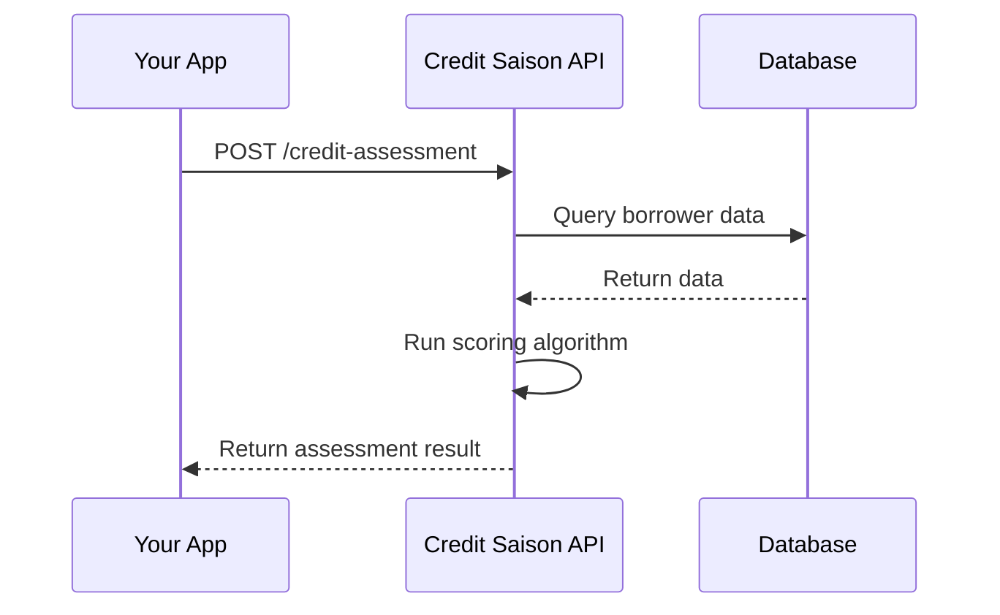

## API Integration Overview

Credit Saison India's APIs provide seamless integration capabilities for credit assessment, risk management, and financial analytics. Our RESTful APIs are designed for high performance and reliability, enabling you to incorporate advanced credit scoring into your existing workflows.

<Tabs>
  <Tab title="Authentication" icon="key">
    Secure your API access with OAuth 2.0 authentication. Obtain access tokens to authorize your requests.
    
    <Steps>
      <Step title="Register Application" icon="user-plus">
        Register your application in the developer portal to receive client credentials.
      </Step>
      <Step title="Request Token" icon="send">
        Use your client ID and secret to request an access token.
        
        ```bash
        curl -X POST https://api.creditsaison.in/oauth/token \
          -H "Content-Type: application/x-www-form-urlencoded" \
          -d "grant_type=client_credentials&client_id=YOUR_CLIENT_ID&client_secret=YOUR_CLIENT_SECRET"
        ```
      </Step>
      <Step title="Use Token" icon="check-circle">
        Include the access token in your API request headers.
      </Step>
    </Steps>
  </Tab>
  <Tab title="Rate Limits" icon="clock">
    Understand our rate limiting policies to ensure smooth API usage.
    
    <Callout kind="info">Default rate limit is 1000 requests per minute per API key.</Callout>
  </Tab>
  <Tab title="Error Handling" icon="alert-circle">
    Implement robust error handling for reliable integration.
    
    ```javascript
try {
  const response = await fetch('/api/credit-score', {
    headers: { 'Authorization': `Bearer ${accessToken}` }
  });
  if (!response.ok) {
    throw new Error(`API Error: ${response.status}`);
  }
  const data = await response.json();
} catch (error) {
  console.error('Integration error:', error);
  // Implement retry logic or fallback
}
    ```
  </Tab>
</Tabs>

## Core Endpoints

Our API provides several core endpoints for credit operations. Each endpoint is designed for specific use cases and data requirements.

<Columns cols={2}>
  <Card title="Credit Assessment" icon="target" href="#credit-assessment">
    Evaluate borrower creditworthiness with comprehensive scoring.
  </Card>
  <Card title="Risk Analysis" icon="alert-triangle" href="#risk-analysis">
    Perform detailed risk analysis and portfolio management.
  </Card>
  <Card title="Borrower Verification" icon="user-check" href="#borrower-verification">
    Verify borrower identity and validate submitted information.
  </Card>
  <Card title="Reporting" icon="bar-chart" href="#reporting">
    Generate detailed reports on credit assessments and trends.
  </Card>
</Columns>

## Credit Assessment Endpoint

The credit assessment endpoint is the primary interface for evaluating borrower profiles.

<Request tabs="curl,python" show-lines="true">
  ```bash
  curl -X POST https://api.creditsaison.in/v1/credit-assessment \
    -H "Authorization: Bearer YOUR_ACCESS_TOKEN" \
    -H "Content-Type: application/json" \
    -d '{
      "borrowerId": "BR001",
      "annualIncome": 600000,
      "existingLoans": 1,
      "creditHistoryLength": 5,
      "employmentStatus": "salaried",
      "residenceType": "owned"
    }'
  ```
  ```python
import requests

url = 'https://api.creditsaison.in/v1/credit-assessment'
headers = {
    'Authorization': 'Bearer YOUR_ACCESS_TOKEN',
    'Content-Type': 'application/json'
}
data = {
    'borrowerId': 'BR001',
    'annualIncome': 600000,
    'existingLoans': 1,
    'creditHistoryLength': 5,
    'employmentStatus': 'salaried',
    'residenceType': 'owned'
}

response = requests.post(url, headers=headers, json=data)
print(response.json())
  ```
</Request>

<Response tabs="200,400,500" show-lines="false">
```json
{
  "borrowerId": "BR001",
  "creditScore": 750,
  "riskLevel": "low",
  "assessmentDate": "2024-01-15T10:30:00Z",
  "factors": {
    "incomeStability": "high",
    "debtRatio": 0.25,
    "paymentHistory": "excellent"
  }
}
```
```json
{
  "error": "Invalid borrower data",
  "code": 400,
  "details": "Annual income must be a positive number"
}
```
```json
{
  "error": "Internal server error",
  "code": 500,
  "details": "Please try again later"
}
```
</Response>

## Webhook Integration

Set up webhooks to receive real-time notifications about credit assessment results and status updates.

<Expandable title="Configuring Webhooks" default-open="true">
  Register webhook endpoints to receive automated notifications.
  
  <ParamField path="webhookUrl" param-type="string" required="true">
    The URL where webhook notifications will be sent.
  </ParamField>
  
  <ParamField query="events" param-type="array" required="false">
    Array of events to subscribe to (e.g., assessment_completed, risk_alert).
  </ParamField>
</Expandable>

<Expandable title="Webhook Payload Example" default-open="false">
  Sample payload structure for webhook notifications.
  
  ```json
  {
    "event": "assessment_completed",
    "borrowerId": "BR001",
    "creditScore": 750,
    "timestamp": "2024-01-15T10:30:00Z",
    "webhookId": "wh_123456"
  }
  ```
</Expandable>

## SDKs and Libraries

Accelerate your integration with our official SDKs for popular programming languages.

| Language | Package | Installation |
|----------|---------|--------------|
| JavaScript | @creditsaison/sdk-js | `npm install @creditsaison/sdk-js` |
| Python | creditsaison-sdk | `pip install creditsaison-sdk` |
| Java | com.creditsaison:sdk | Maven dependency |
| .NET | CreditSaison.SDK | NuGet package |

<CodeGroup tabs="javascript,python">
  ```javascript
import { CreditSaisonClient } from '@creditsaison/sdk-js';

const client = new CreditSaisonClient({
  apiKey: 'your_api_key',
  environment: 'production'
});

const assessment = await client.assessCredit({
  borrowerId: 'BR001',
  annualIncome: 600000
});
console.log('Credit Score:', assessment.score);
  ```
  ```python
from creditsaison import CreditSaisonClient

client = CreditSaisonClient(
    api_key='your_api_key',
    environment='production'
)

assessment = client.assess_credit(
    borrower_id='BR001',
    annual_income=600000
)
print(f'Credit Score: {assessment.score}')
  ```
</CodeGroup>

<Callout kind="tip">Use our SDKs for simplified authentication, automatic retries, and built-in error handling.</Callout>

## Testing and Sandbox

Test your integration in our sandbox environment before going live.

- **Sandbox URL**: `https://sandbox-api.creditsaison.in`
- **Test Data**: Use provided test borrower profiles
- **Rate Limits**: Relaxed limits for development
- **Error Simulation**: Test various error scenarios

<Mermaid>

</Mermaid>