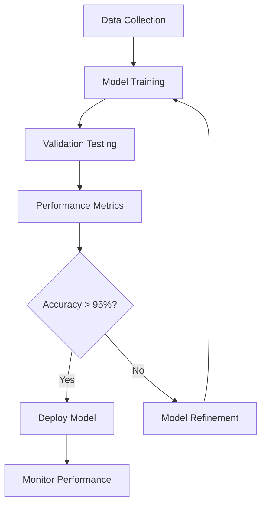

## Credit Scoring Fundamentals

Credit scoring at Credit Saison India utilizes advanced machine learning algorithms and comprehensive data analysis to evaluate borrower creditworthiness. Our models consider multiple factors including income stability, debt history, employment status, and behavioral patterns to generate accurate risk assessments.

<Columns cols={3}>
  <Card title="Scoring Models" icon="cpu" href="#scoring-models">
    Explore our proprietary scoring algorithms and methodologies.
  </Card>
  <Card title="Data Factors" icon="database" href="#data-factors">
    Understand the key data points used in credit evaluations.
  </Card>
  <Card title="Risk Assessment" icon="alert-triangle" href="#risk-assessment">
    Learn how we categorize and interpret risk levels.
  </Card>
</Columns>

## Scoring Models

We employ multiple scoring models tailored for different lending scenarios and borrower profiles.

<Tabs>
  <Tab title="Personal Loans" icon="user">
    Optimized for personal loan applications with focus on individual financial behavior.
    
    <Expandable title="Model Features" default-open="true">
      - Income verification and stability analysis
      - Credit utilization patterns
      - Payment history across accounts
      - Employment continuity
    </Expandable>
  </Tab>
  <Tab title="Business Loans" icon="building" icon="building-2">
    Designed for SME and business lending with emphasis on business performance metrics.
    
    <Expandable title="Model Features" default-open="true">
      - Business revenue trends
      - Industry risk factors
      - Owner credit history
      - Cash flow analysis
    </Expandable>
  </Tab>
  <Tab title="Credit Cards" icon="credit-card">
    Specialized for credit card approvals with real-time decision capabilities.
    
    <Expandable title="Model Features" default-open="true">
      - Instant income verification
      - Behavioral scoring
      - Network analysis
      - Fraud detection integration
    </Expandable>
  </Tab>
</Tabs>

## Data Factors in Scoring

Our credit scoring considers a comprehensive set of data factors to provide accurate risk assessments.

| Factor Category | Weight | Description |
|-----------------|--------|-------------|
| Income & Employment | 25% | Stability, verification, and employment history |
| Credit History | 30% | Payment patterns, outstanding debts, and credit utilization |
| Demographics | 15% | Age, location, and socioeconomic indicators |
| Behavioral Data | 20% | Transaction patterns and financial habits |
| External Data | 10% | Industry reports and economic indicators |

<Steps>
  <Step title="Data Collection" icon="database">
    Gather comprehensive borrower information from multiple sources.
    
    ```javascript
const borrowerData = {
  personalInfo: {
    age: 35,
    income: 800000,
    employment: 'salaried',
    residence: 'owned'
  },
  creditHistory: {
    totalLoans: 2,
    onTimePayments: 95,
    creditUtilization: 0.3
  },
  behavioral: {
    monthlyTransactions: 150,
    savingsRate: 0.2
  }
};
    ```
  </Step>
  <Step title="Data Validation" icon="check-circle">
    Verify data accuracy and completeness before processing.
  </Step>
  <Step title="Scoring Calculation" icon="calculator">
    Apply weighted algorithms to generate credit scores.
  </Step>
  <Step title="Risk Categorization" icon="bar-chart">
    Classify borrowers into risk categories for lending decisions.
  </Step>
</Steps>

## Risk Assessment Levels

Credit scores are categorized into risk levels to guide lending decisions.

| Score Range | Risk Level | Approval Rate | Interest Rate Range |
|-------------|------------|---------------|---------------------|
| 800-900 | Excellent | 95% | 8-12% |
| 700-799 | Good | 85% | 12-16% |
| 600-699 | Fair | 65% | 16-20% |
| 500-599 | Poor | 35% | 20-25% |
| 300-499 | Very Poor | 10% | 25%+ |

<Callout kind="info">Risk levels are calibrated based on historical default rates and market conditions.</Callout>

## Scoring API Usage

Integrate credit scoring into your applications using our REST API.

<Request tabs="curl,python" show-lines="true">
  ```bash
  curl -X POST https://api.creditsaison.in/v1/credit-score \
    -H "Authorization: Bearer YOUR_ACCESS_TOKEN" \
    -H "Content-Type: application/json" \
    -d '{
      "borrowerId": "BR001",
      "modelType": "personal_loan",
      "data": {
        "income": 750000,
        "existingLoans": 1,
        "creditHistory": "good"
      }
    }'
  ```
  ```python
import requests

url = 'https://api.creditsaison.in/v1/credit-score'
headers = {
    'Authorization': 'Bearer YOUR_ACCESS_TOKEN',
    'Content-Type': 'application/json'
}
data = {
    'borrowerId': 'BR001',
    'modelType': 'personal_loan',
    'data': {
        'income': 750000,
        'existingLoans': 1,
        'creditHistory': 'good'
    }
}

response = requests.post(url, headers=headers, json=data)
print(response.json())
  ```
</Request>

<Response tabs="200,422" show-lines="false">
```json
{
  "borrowerId": "BR001",
  "creditScore": 785,
  "riskLevel": "good",
  "confidence": 0.92,
  "factors": {
    "incomeFactor": 0.85,
    "creditFactor": 0.78,
    "behavioralFactor": 0.82
  },
  "modelVersion": "v2.1"
}
```
```json
{
  "error": "Insufficient data for scoring",
  "code": 422,
  "requiredFields": ["income", "employment_status"],
  "details": "Please provide complete borrower information"
}
```
</Response>

## Model Interpretability

Understand how our models arrive at credit scores with detailed factor analysis.

<Expandable title="Factor Analysis" default-open="true">
  Each scoring result includes detailed factor contributions.
  
  | Factor | Contribution | Impact |
  |--------|--------------|--------|
  | Income Stability | +15 points | Positive - consistent high income |
  | Payment History | +20 points | Positive - excellent track record |
  | Debt Ratio | -10 points | Negative - high existing debt |
  | Employment Length | +5 points | Positive - long-term employment |
</Expandable>

<Expandable title="Score Explanation" default-open="false">
  Access detailed explanations for score calculations.
  
  ```json
  {
    "score": 785,
    "explanation": "Strong income stability and payment history offset moderate debt levels",
    "recommendations": [
      "Consider reducing credit utilization",
      "Maintain consistent payment patterns"
    ]
  }
  ```
</Expandable>

## Model Updates and Validation

Our scoring models are continuously updated and validated for accuracy.

<Callout kind="tip">Models are retrained quarterly using the latest borrower data and market conditions.</Callout>

<Mermaid>

</Mermaid>

## Best Practices

Follow these best practices for optimal credit scoring implementation.

- **Data Quality**: Ensure all input data is accurate and up-to-date
- **Regular Updates**: Refresh borrower data periodically for current assessments
- **Model Selection**: Choose the appropriate scoring model for your use case
- **Threshold Setting**: Define approval thresholds based on your risk tolerance
- **Monitoring**: Track scoring performance and adjust models as needed

<ExpandableGroup>
  <Expandable title="FAQ: Score Interpretation" default-open="false">
    How should I interpret credit scores in lending decisions?
    
    Credit scores provide a standardized way to assess risk, but they should be used as one factor among many in your lending process. Consider the borrower's overall financial situation, market conditions, and your institution's risk appetite when making final decisions.
  </Expandable>
  <Expandable title="FAQ: Score Updates" default-open="false">
    How often should borrower scores be updated?
    
    We recommend updating credit scores at least quarterly for existing borrowers, or before major lending decisions. Real-time updates may be necessary for high-value applications or when significant changes occur in the borrower's financial situation.
  </Expandable>
  <Expandable title="FAQ: Model Customization" default-open="false">
    Can scoring models be customized for specific requirements?
    
    Yes, we offer custom model development services for institutions with unique risk profiles or regulatory requirements. Contact our enterprise solutions team to discuss customization options.
  </Expandable>
</ExpandableGroup>