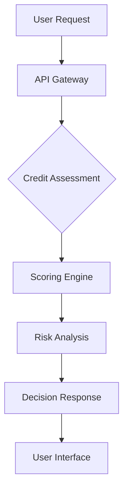

## Getting Started with Credit Saison India

Credit Saison India empowers India's credit growth with innovative financial solutions, driving business success and financial inclusion. Our platform provides comprehensive credit assessment and management tools to help businesses make informed lending decisions. Whether you're a financial institution or a business seeking credit solutions, our API and services are designed to streamline your processes and enhance financial outcomes.

<Columns cols={3}>
  <Card title="API Integration" icon="code" href="api-integration">
    Seamlessly integrate our credit scoring and assessment APIs into your existing systems for real-time credit evaluations.
  </Card>
  <Card title="Credit Scoring" icon="target" href="credit-scoring">
    Leverage advanced algorithms and data analytics to assess creditworthiness and risk profiles accurately.
  </Card>
  <Card title="Security & Compliance" icon="shield" href="security-compliance">
    Ensure data protection and regulatory compliance with our robust security frameworks and compliance tools.
  </Card>
</Columns>

## Key Features

Credit Saison India offers a suite of powerful features designed to revolutionize credit management in India. Our solutions are built on cutting-edge technology and deep financial expertise.

<Tabs>
  <Tab title="Credit Assessment" icon="check-circle">
    Perform comprehensive credit assessments using our proprietary scoring models. Evaluate borrower profiles, financial history, and risk factors with precision.
    
    <Steps>
      <Step title="Collect Data" icon="database">
        Gather borrower information, financial statements, and transaction history.
      </Step>
      <Step title="Run Assessment" icon="cpu">
        Utilize our API to process data through advanced credit scoring algorithms.
      </Step>
      <Step title="Review Results" icon="eye">
        Analyze the credit score and risk assessment report for decision-making.
      </Step>
    </Steps>
  </Tab>
  <Tab title="Risk Management" icon="alert-triangle">
    Monitor and manage credit risk effectively with real-time insights and predictive analytics.
    
    <Callout kind="tip">Implement proactive risk mitigation strategies to minimize defaults and improve portfolio performance.</Callout>
  </Tab>
  <Tab title="Integration Options" icon="plug">
    Connect with popular banking systems, CRM platforms, and financial software for seamless workflow integration.
  </Tab>
</Tabs>

## Quick Start Guide

Get started with Credit Saison India in just a few simple steps. Our platform is designed for ease of use while providing powerful capabilities.

<Expandable title="Setting Up Your Account" default-open="true">
  Create your account and obtain API credentials to begin using our services.
  
  <CodeGroup tabs="curl,python">
    ```bash
    curl -X POST https://api.creditsaison.in/v1/auth \
      -H "Content-Type: application/json" \
      -d '{"username":"your_username","password":"your_password"}'
    ```
    ```python
import requests

response = requests.post(
    'https://api.creditsaison.in/v1/auth',
    json={'username': 'your_username', 'password': 'your_password'}
)
print(response.json())
    ```
  </CodeGroup>
</Expandable>

<Expandable title="First API Call" default-open="false">
  Make your first credit assessment request to test the integration.
  
  ```javascript
const creditAssessment = {
  borrowerId: 'BR001',
  income: 50000,
  existingLoans: 2,
  creditHistory: 'good'
};

fetch('/api/credit-assess', {
  method: 'POST',
  headers: { 'Content-Type': 'application/json' },
  body: JSON.stringify(creditAssessment)
})
.then(response => response.json())
.then(data => console.log('Credit Score:', data.score));
  ```
</Expandable>

## Use Cases

Credit Saison India serves various industries and business models. Discover how our solutions can benefit your organization.

| Industry | Use Case | Benefit |
|----------|----------|---------|
| Banking | Loan Approval Process | Faster decisions with accurate risk assessment |
| Fintech | Credit Card Issuance | Automated scoring for instant approvals |
| NBFCs | SME Lending | Comprehensive borrower evaluation |
| E-commerce | Buy Now Pay Later | Real-time credit checks for seamless checkout |

<Callout kind="info">Explore our documentation to learn more about implementing these use cases with our APIs.</Callout>

## Support and Resources

Access comprehensive support and learning resources to maximize your use of Credit Saison India.

- **API Documentation**: Detailed guides for all endpoints and features
- **SDKs**: Pre-built libraries for popular programming languages
- **Webinars**: Live sessions on best practices and new features
- **Community Forum**: Connect with other developers and share insights

<Mermaid>

</Mermaid>