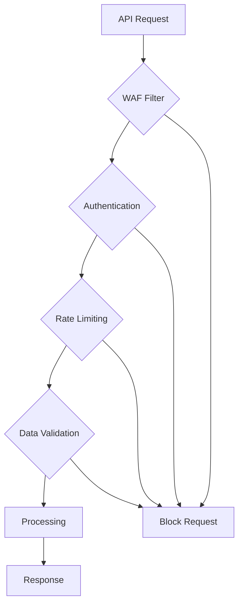

## Security and Compliance Overview

Credit Saison India prioritizes security and regulatory compliance in all our financial services. Our platform adheres to industry standards and Indian financial regulations, ensuring the protection of sensitive borrower data and maintaining trust in the credit ecosystem.

<Columns cols={3}>
  <Card title="Data Encryption" icon="lock" href="#data-encryption">
    Advanced encryption methods protect data in transit and at rest.
  </Card>
  <Card title="Regulatory Compliance" icon="shield" href="#regulatory-compliance">
    Full compliance with RBI guidelines and data protection laws.
  </Card>
  <Card title="Access Controls" icon="key" href="#access-controls">
    Granular permissions and multi-factor authentication.
  </Card>
</Columns>

## Data Encryption Standards

We implement comprehensive encryption to protect sensitive financial data throughout its lifecycle.

<Tabs>
  <Tab title="In Transit" icon="send">
    All API communications are secured with TLS 1.3 encryption.
    
    <Callout kind="info">We enforce HTTPS-only connections and regularly update SSL certificates.</Callout>
  </Tab>
  <Tab title="At Rest" icon="database">
    Database encryption using AES-256 standard with key rotation.
    
    <Expandable title="Encryption Details" default-open="true">
      - AES-256-GCM encryption for all stored data
      - Automatic key rotation every 90 days
      - Secure key management with HSM integration
    </Expandable>
  </Tab>
  <Tab title="End-to-End" icon="lock">
    Complete data protection from client to database and back.
  </Tab>
</Tabs>

## Regulatory Compliance

Credit Saison India maintains full compliance with Indian financial regulations and international standards.

| Regulation | Compliance Status | Key Requirements |
|------------|-------------------|------------------|
| RBI Guidelines | Fully Compliant | KYC, AML, credit reporting standards |
| PDPA 2023 | Certified | Data protection and privacy principles |
| ISO 27001 | Certified | Information security management |
| PCI DSS | Level 1 Compliant | Payment card data security |

<Steps>
  <Step title="KYC Verification" icon="user-check">
    Implement comprehensive Know Your Customer processes.
    
    ```javascript
const kycVerification = {
  borrowerId: 'BR001',
  documents: ['aadhar', 'pan', 'bank_statement'],
  biometric: true,
  livenessCheck: true
};

// API call for KYC verification
await verifyKYC(kycVerification);
    ```
  </Step>
  <Step title="AML Screening" icon="search">
    Conduct Anti-Money Laundering checks against global watchlists.
  </Step>
  <Step title="Data Privacy" icon="eye-off">
    Ensure data minimization and purpose limitation.
  </Step>
  <Step title="Audit Logging" icon="file-text">
    Maintain comprehensive audit trails for all transactions.
  </Step>
</Steps>

## Access Control and Authentication

Multi-layered access controls protect your data and ensure authorized access only.

<Expandable title="Authentication Methods" default-open="true">
  Choose from multiple secure authentication options.
  
  - **OAuth 2.0**: Industry-standard token-based authentication
  - **API Keys**: Unique keys with granular permissions
  - **MFA**: Multi-factor authentication for admin access
  - **Certificate-based**: Mutual TLS for high-security environments
</Expandable>

<Expandable title="Role-Based Access Control" default-open="false">
  Define user roles and permissions for different access levels.
  
  | Role | Permissions | Use Case |
  |------|-------------|----------|
  | Admin | Full access, user management | System administrators |
  | Analyst | Read credit data, generate reports | Risk analysts |
  | API User | API access, limited data | Integration partners |
  | Auditor | Read-only audit logs | Compliance officers |
</Expandable>

## Security Monitoring

Continuous monitoring and threat detection protect against security incidents.

<Mermaid>

</Mermaid>

<Callout kind="alert">All security events are logged and monitored 24/7 with automated alerting for suspicious activities.</Callout>

## Incident Response

Established procedures for handling security incidents and data breaches.

<ExpandableGroup>
  <Expandable title="Incident Detection" default-open="true">
    How we detect and respond to security incidents.
    
    Our SOC team monitors for:
    - Unusual API usage patterns
    - Failed authentication attempts
    - Data exfiltration attempts
    - System anomalies
  </Expandable>
  <Expandable title="Response Protocol" default-open="false">
    Standardized incident response procedures.
    
    1. **Detection**: Automated alerts trigger incident response
    2. **Assessment**: Security team evaluates the threat
    3. **Containment**: Isolate affected systems
    4. **Eradication**: Remove threats and vulnerabilities
    5. **Recovery**: Restore systems and monitor
    6. **Lessons Learned**: Update procedures and training
  </Expandable>
  <Expandable title="Notification Requirements" default-open="false">
    Regulatory reporting and customer notifications.
    
    - **RBI**: Report incidents within 6 hours
    - **Customers**: Notify within 72 hours for data breaches
    - **CERT-In**: Coordinate with national cyber security agency
  </Expandable>
</ExpandableGroup>

## Data Privacy and Consent

Respect user privacy with transparent data handling and consent management.

<Request tabs="curl,python" show-lines="true">
  ```bash
  curl -X POST https://api.creditsaison.in/v1/consent \
    -H "Authorization: Bearer YOUR_ACCESS_TOKEN" \
    -H "Content-Type: application/json" \
    -d '{
      "borrowerId": "BR001",
      "consentType": "credit_check",
      "purpose": "Loan application processing",
      "validity": "2025-12-31",
      "dataScope": ["personal_info", "credit_history"]
    }'
  ```
  ```python
import requests

url = 'https://api.creditsaison.in/v1/consent'
headers = {
    'Authorization': 'Bearer YOUR_ACCESS_TOKEN',
    'Content-Type': 'application/json'
}
data = {
    'borrowerId': 'BR001',
    'consentType': 'credit_check',
    'purpose': 'Loan application processing',
    'validity': '2025-12-31',
    'dataScope': ['personal_info', 'credit_history']
}

response = requests.post(url, headers=headers, json=data)
print(response.json())
  ```
</Request>

<Response tabs="201,400" show-lines="false">
```json
{
  "consentId": "consent_123456",
  "status": "granted",
  "grantedAt": "2024-01-15T10:30:00Z",
  "expiresAt": "2025-12-31T23:59:59Z",
  "consentDetails": {
    "borrowerId": "BR001",
    "purpose": "Loan application processing",
    "dataCategories": ["personal_info", "credit_history"]
  }
}
```
```json
{
  "error": "Invalid consent request",
  "code": 400,
  "details": "Borrower must be 18+ for credit consent"
}
```
</Response>

## Penetration Testing and Audits

Regular security assessments ensure ongoing protection of your data.

- **Quarterly Penetration Testing**: External security firms test our systems
- **Annual Security Audits**: Independent auditors verify compliance
- **Vulnerability Scanning**: Automated weekly scans for known vulnerabilities
- **Code Reviews**: Security-focused code reviews for all releases

<Callout kind="success">Our security certifications are renewed annually and available for customer review.</Callout>

## Best Practices for Integration

Follow these security best practices when integrating with our platform.

1. **Use HTTPS Only**: Never transmit sensitive data over unencrypted connections
2. **Secure API Keys**: Store keys securely and rotate them regularly
3. **Implement Rate Limiting**: Protect against abuse and DoS attacks
4. **Validate Input Data**: Sanitize all user inputs to prevent injection attacks
5. **Monitor API Usage**: Track usage patterns and set up alerts for anomalies
6. **Regular Security Updates**: Keep your integration libraries updated

<Expandable title="Security Checklist" default-open="false">
  Download our comprehensive security checklist for integration partners.
  
  - [ ] Implement proper authentication
  - [ ] Enable HTTPS/TLS 1.3
  - [ ] Set up monitoring and alerting
  - [ ] Configure rate limiting
  - [ ] Implement input validation
  - [ ] Regular security updates
  - [ ] Conduct penetration testing
</Expandable>